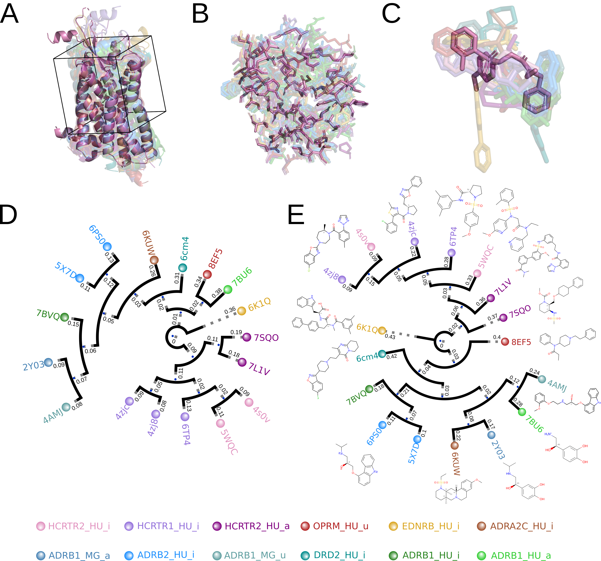
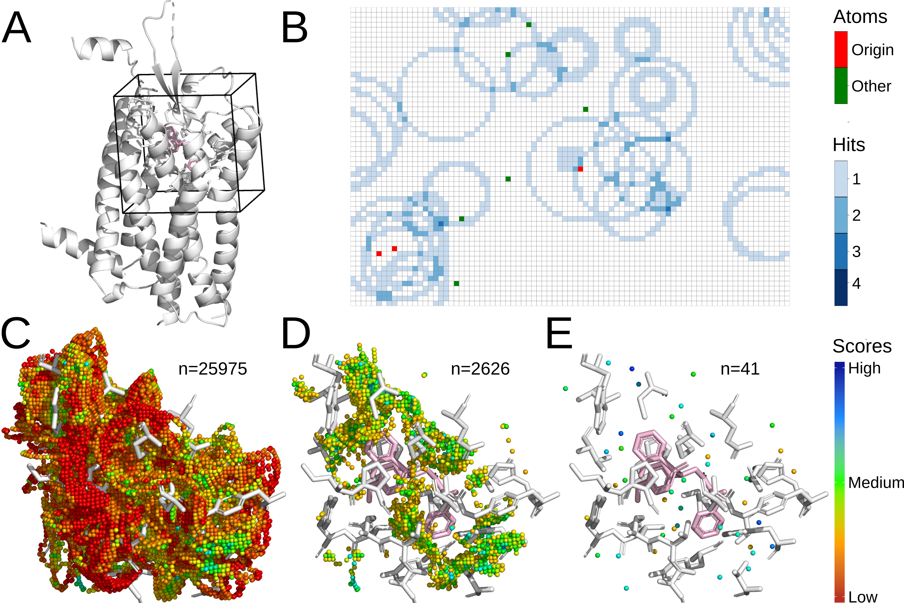

# Grid_methods

<p style='text-align: justify;'>
This project provides a set of scripts that represent protein structures, pockets, and ligands as sparse 3D grids for two related applications: (1) <b>Grid comparison</b>, which structurally aligns and compares structures/ligands by projecting their Van der Waals volumes onto a shared grid, deriving a Tanimoto-like similarity and coverage between each pair, and building hierarchical clustering heatmaps and similarity trees; and (2) <b>Hotspot</b> detection, which scores every grid position around a structure by comparing its local atomic environment to the average density observed for that atom type in a training set, then iteratively proposes hotspots, i.e. positions favorable for a given atom type (e.g. water oxygens).
</p>


## Project Organization

The project is organized as follows:
```plaintext
Project/
├── config/                                 <- Configuration files for the project.
│   ├── global_parameters.txt               <- Parameters shared by both pipelines (grid, pocket, cleaning, base parameters).
│   ├── comparison_parameters.txt           <- Parameters for the structure comparison pipeline.
│   └── hotspot_parameters.txt              <- Parameters for the structure hotspot pipeline.
├── data/
│   ├── densities/                          <- The density distribution for each atom type in the training set.
│   │   ├── custom/
│   │   └── sybyl/
│   ├── input/                              <- The input data for the pipelines.
│   │   ├── structures_comparison/          <- Structures to compare (default path used by comparison_parameters.txt).
│   │   └── hotspot/                        <- Structures to score/analyze for hotspots (default path used by hotspot_parameters.txt).
│   └── output/                             <- The output of the pipelines.
│       ├── structures_comparison/
│       │   └── dd_mm_yyyy-hh_mm/           <- Folder named by the date and time of the run.
│       │       └── cleaned_dataset/        <- Cleaned and structurally aligned structures for the run.
│       └── hotspot/
│           └── dd_mm_yyyy-hh_mm/           <- Folder named by the date and time of the run.
│               └── cleaned_dataset/        <- Cleaned structures for the run.
├── src/                                    <- Source code for use in this project.
│   ├── cla/                                <- Class definitions (PDB structure, System).
│   ├── comparison/                         <- Source code for the structure comparison pipeline.
│   ├── hotspots/                           <- Source code for the structure hotspot pipeline.
│   ├── lib/                                <- Shared library and utility functions.
│   ├── pymol_plugins/                      <- PyMOL helper scripts (dataset cleaning, structural alignment, pocket extraction).
│   └── main.py                             <- Main entry point of the project.
├── assets/                                 <- Images used in this README (inputs, outputs, method figures).
└── README.md (this file)                   <- Readme file with instructions on how to use the project.
```
Ensure that you familiarize yourself with the project structure for easy navigation and understanding of the data organization.

## Installation

### Prerequisites

You will need [Python 3.9](https://www.python.org/downloads/) and [Conda](https://docs.conda.io/projects/conda/en/latest/user-guide/install/) installed on your machine.

This project does not currently ship a conda `environment.yml` or `requirements.txt` file. The dependencies below were identified from the imports used across `src/` and can be installed manually:

```bash
conda create -n Grid_methods python=3.9
conda activate Grid_methods
conda install -c conda-forge -c schrodinger pymol-open-source openbabel mendeleev ete3
pip install numpy pandas scipy scikit-learn matplotlib seaborn biopython tqdm psutil
```

`pymol` and `openbabel` are easiest to install through conda-forge; the remaining packages can also be installed with pip if you prefer a virtual environment instead of Conda.

## Usage

### Global parameters

Adjust [`config/global_parameters.txt`](config/global_parameters.txt) to select which pipeline(s) to run and to configure the grid shared by both pipelines:

- **Pipeline switches**: `run_comparison` and `run_hotspot` toggle the structure comparison and structure hotspot pipelines independently.
- **Grid parameters**: `explicit_grid` (3D array vs. lighter 1D array), `atom_type` (`custom` or `SYBYL`, see below), `grid_spacing`, `grid_padding`, and `align_principal_axes`.
- **Pocket parameters**: `pocket_res_name`, `pocket_res_id`, `lig_chain`, and `pocket_size` control how a pocket is carved out around a ligand/residue of interest.
- **Cleaning parameters**: `discard_hetatm`, `discard_atom`, `discard_hydrogen`, `discard_water`, `discard_alternative`, and the `keep_*`/`discard_*` chain, residue, residue id, and atom filters used to prepare the input structures.
- **Base parameters**: `cpu_allocated` controls the number of CPUs used.
- **PyMOL parameters**: `watch_live`, `create_pymol_session`, and `session_name` control the PyMOL session generated for the run.

### Atom Type Configuration

- **custom**: This option uses a homemade conversion table to categorize the standard pdb atom types into the following simplified set of 12 custom atom types, shared by all standard amino acids.

| Element Name |                        Included Atoms/Residue Names                         |                                                       Description                                                       |
|:------------:|:---------------------------------------------------------------------------:|:-----------------------------------------------------------------------------------------------------------------------:|
|      H       |                              Any hydrogen atom                              |                           All hydrogen atoms regardless of their location or bonding context.                           |
|     Car      |    C in aromatic rings, ARG (CZ), GLN (CD), GLU (CD), ASP (CG), ASN (CG)    |                                      Aromatic and certain side chain carbon atoms.                                      |
|     Nbas     |              N in ARG (NH1, NH2, NE), HIS (NE2, ND1), LYS (NZ)              |            Nitrogen atoms with basic properties, often involved in hydrogen bonding and ionic interactions.             |
|     Nam      |  N in amide groups of ASN (ND2), GLN (NE2), TRP (NE1), peptide main chain   |         Nitrogen atoms in the amide groups of ASN and GLN, peptide main chain, and the indole nitrogen of TRP.          |
|      Oh      |            O in hydroxyl groups of SER (OG), THR (OG1), TYR (OH)            |                           Oxygen atoms in hydroxyl groups, capable of forming hydrogen bonds.                           |
|      Oc      |      O in carbonyl groups of ASN (OD1), GLN (OE1), peptide main chain       | Oxygen atoms in carbonyl groups, typically involved in hydrogen bonding, including those in the main chain of peptides. |
|     Oox      | O in carboxylate groups of ASP (OD1, OD2), GLU (OE1, OE2), C-terminus (OXT) |               Oxygen atoms typically seen in carboxylate groups or at the C-terminus of a protein chain.                |
|     Xot      |                   Atoms not fitting predefined categories                   | Atoms that do not match any other specified category, including various aliphatic carbons, sulfur, and uncommon atoms.  |
|     Oow      |                          Water molecule 'HOH' (O)                           |                Oxygen atoms in water molecules, important for hydration and protein structure stability.                |
|     Meta     |                       Metal atoms (e.g., FE, MG, CA)                        |                  Metal ions that can act as cofactors or structural elements within protein complexes.                  |
|    Hetatm    |                   Atoms from ligands or other heteroatoms                   |         Atoms from non-standard residues or ligands that are not covered by the standard amino acid categories.         |
|    Empty     |                                  None (-)                                   |      Placeholder for an environment that has fewer neighbors than the specified size; used to maintain uniformity.      |

- **SYBYL**: When selected, protein and ligand atoms are mapped to SYBYL atom types using the Open Babel library, which infers connectivity, valence and hybridization state from the PDB coordinates. This choice is recommended for analyses that require the more detailed atom type distinctions provided by the SYBYL classification, including ligands, solvent, and metal ions. A dedicated `O.3.wat` type is used for water oxygens; atoms that do not match a standard SYBYL category (e.g. many metals) fall back to their element symbol, and an aggregated `elt_symbol` reference density is used for scoring these element-based types when no atom-specific density is available.

The table below lists the SYBYL atom types used in this project along with their chemical interpretation, as described in the project's supporting information:

|   SYBYL Type   |            Description             |                                                                                           Chemical Context                                                                                            |
|:---------------:|:-----------------------------------:|:------------------------------------------------------------------------------------------------------------------------------------------------------------------------------------------------------:|
|      C.3        |             sp3 carbon              |                                                                                        Aliphatic carbon                                                                                        |
|      C.2        |             sp2 carbon              |                                                                                 Alkenes, carbonyl carbons                                                                                       |
|      C.1        |              sp carbon              |                                                                                             Alkynes                                                                                            |
|     C.ar        |          Aromatic carbon            |                                                                                          Aromatic rings                                                                                        |
|     C.cat       |            Carbocation              |                                                                                    Positively charged carbon                                                                                   |
|      N.3        |            sp3 nitrogen             |                                                                                              Amines                                                                                            |
|      N.2        |            sp2 nitrogen             |                                                                                     Imines, amides                                                                                             |
|      N.1        |             sp nitrogen             |                                                                                            Nitriles                                                                                            |
|     N.ar        |         Aromatic nitrogen           |                                                                                     Heteroaromatic rings                                                                                       |
|     N.am        |           Amide nitrogen            |                                                                                     Peptide bonds, amides                                                                                       |
|    N.pl3        |    Trigonal planar nitrogen         |                                                                                     Conjugated systems                                                                                         |
|      N.4        |  sp3 positively charged nitrogen    |                                                                                     Ammonium groups                                                                                            |
|      O.3        |             sp3 oxygen              |                                                                                     Alcohols, ethers                                                                                           |
|      O.2        |             sp2 oxygen              |                                                                                     Carbonyl oxygen                                                                                            |
|    O.co2        |         Carboxylate oxygen          |                                                                                Carboxylates, phosphates                                                                                        |
|   O.3.wat       |            Water oxygen             |                                                                                       Water molecules                                                                                          |
|      S.3        |             sp3 sulfur              |                                                                                       Thiols, sulfides                                                                                         |
|      S.2        |             sp2 sulfur              |                                                                                     Double-bonded sulfur                                                                                       |
|      S.o        |          Sulfoxide sulfur           |                                                                                            Sulfoxides                                                                                          |
|     S.o2        |           Sulfone sulfur            |                                                                                             Sulfones                                                                                           |
|      P.3        |           sp3 phosphorus            |                                                                                            Phosphates                                                                                          |
|       F         |              Fluorine               |                                                                                              Halogen                                                                                           |
|      Cl         |              Chlorine               |                                                                                              Halogen                                                                                           |
|      Br         |              Bromine                |                                                                                              Halogen                                                                                           |
|       I         |               Iodine                |                                                                                              Halogen                                                                                           |
|    Cr.th        |              Chromium               |                                                                                               Metal                                                                                            |
|    Cr.oh        |              Chromium               |                                                                                               Metal                                                                                            |
|    Co.oh        |               Cobalt                |                                                                                               Metal                                                                                            |
|    Ru.oh        |              Ruthenium              |                                                                                               Metal                                                                                            |
|       Du        |            Dummy atom               |                                     Non-physical placeholder atom used for internal representation when no chemically meaningful atom type can be assigned                                    |
|  Element name    |         Element-based type          | Atoms not assigned to a standard SYBYL category are labeled using their element symbol. For scoring purposes, an aggregated fallback category (`elt_symbol`) is defined by pooling these element-based types, ensuring that a reference density is available when no specific density exists for a given atom type. |
|     Empty        |          Empty environment          |                                                        Placeholder for an environment that has fewer neighbors than the specified size.                                                       |

### Structure comparison

Adjust [`config/comparison_parameters.txt`](config/comparison_parameters.txt) to configure the structure comparison pipeline (used when `run_comparison = True`). Parameters include:

- **Input/output paths**: `path_to_PDB_directory`, `path_to_output_directory`, `path_to_cleaned_directory`.
- **Comparison parameters**: `consider_elements` (distinguish atom types or compare volumes only), `comparison_normalisation` (`Min`/`Max`), `grid_geometry`, `delete_grid`.
- **Data management**: `database`, `dataset_status` (whether the input is already cleaned/aligned), `tmalign_reference`.
- **Tree generation**: `tree` (`structures`, `sequences`, or `both`), plus display options (`tree_name`, `node_name`, `tree_shape`, `sphere_color`, `label_color`, `show_distances`, `line_width`, `tree_scale`, `branch_length`, `only_topology`, `leaf_name`) and save/show flags for the structure and sequence trees.

This pipeline structurally aligns the input structures (via a TMalign PyMOL plugin), builds a 3D grid for each of them, compares the grids pairwise, and produces structure-similarity and/or sequence-similarity trees.

### Hotspot

Adjust [`config/hotspot_parameters.txt`](config/hotspot_parameters.txt) to configure the hotspot pipeline (used when `run_hotspot = True`). Parameters include:

- **Input/output paths**: `path_to_PDB_directory`, `path_to_output_directory`.
- **Hotspot parameters**: `grid_geometry` (`Sphere`, `Taxicab`, or `Uniform`), `max_neighbor_number`.
- **Atom scoring**: `electronic_densities_folder` and `normalize_electronic_densities` control the reference densities used to score each grid position.
- **Hotspot generation**: `hotspot_type` (the custom or SYBYL atom type to place at hotspots), `tag_threshold`, `bad_score_threshold`, `good_score_threshold`, and `number_of_rounds`.

This pipeline scores every atom of the input structure/pocket by comparing its local environment (the distance-ranked neighbors within a cutoff) to precomputed reference density distributions, yielding a fitness score. Atoms with a low score are used as origins to tag nearby grid voxels at the optimal interaction distance for the requested atom type; voxels tagged often enough, and not clashing with the structure, are retained as hotspots.

## Running the Script

Protein structures to be processed should be placed in [`data/input/structures_comparison`](data/input/structures_comparison) and/or [`data/input/hotspot`](data/input/hotspot) depending on the pipeline(s) enabled, and must be in `.pdb` format.


### From the command line

Navigate to the `src` directory, activate the environment if not already active, and execute [`main.py`](src/main.py) as follows:

```bash
cd src
conda activate Grid_methods
python main.py
```

### From an IDE (e.g. VS Code) (TO IMPROVE OR REMOVE)

Open the project folder in VS Code, select the `Grid_methods` Conda environment as the Python interpreter (bottom-right interpreter picker, or `Python: Select Interpreter` from the command palette), open [`src/main.py`](src/main.py), and use the **Run Python File** button (or `F5` to run with the debugger attached). Make sure the working directory is set to `src/` (e.g. via a `.vscode/launch.json` `"cwd"` entry) so that the relative paths in the parameter files resolve correctly.

## Output

The scripts generate their output in the [`data/output`](data/output) directory, under `structures_comparison/` and/or `hotspot/`, with one folder per run named by the date and time of the run. Each run folder includes a `cleaned_dataset/` directory with the cleaned (and, for the comparison pipeline, structurally aligned) input structures, alongside the pipeline-specific results:

- **Structure comparison**: the pairwise distance and coverage matrices (`distances_df.ods`, `coverage_df.ods`) together with their heatmaps (`distances_heatmap.svg`, `coverage_heatmap.svg`), the structural and/or sequence similarity trees (Newick and SVG), the PyMOL alignment session, and grid visualizations of the compared structures (e.g. grid points before/after Van der Waals exclusion).

  

- **Hotspot**: for each input structure, a `_scored.pdb` file with the atomic fitness score annotated in the b-factor column, a `_scored.csv` file with the full per-atom scoring data, and a `_hotspot.pse` PyMOL session showing the proposed hotspots for the requested atom type.

  

## Reference data

The density distribution data used in this project are derived from a training dataset of protein structures called PDB30.
PDB30 is a subset of the structures in [the Protein Data Bank (PDB)](https://www.rcsb.org/) that aim to represent the diversity of protein structures in the PDB and minimize redundancy.
This dataset is based on [this file](https://cdn.rcsb.org/resources/sequence/clusters/clusters-by-entity-30.txt) available on the RCSB website,
where all PDB entries larger than 20 amino acids and sharing over 30% of sequences similarity have been clustered together
using [MMseq2](https://www.rcsb.org/docs/programmatic-access/file-download-services). The version of the clustering used in this project was downloaded the 19/01/2018 with 27 330 clusters.
From each cluster, the structure with the highest resolution determined by X-ray crystallography was chosen as the representative for a total of 22,930 structures with a mean resolution of 2.27 Å and a standard deviation of 0.66 Å, yielding 1,000 reference distance density distributions for the custom atom types.

For the SYBYL atom types, this PDB30-based training set was further augmented with X-ray structures containing 24,353 unique ligands (restricting the retained environments to within 10 Å of ligand atoms), yielding 10,012 reference distance density distributions reflecting the increased granularity of the SYBYL classification.

The reference data are located within the [`data/densities`](data/densities) directory, categorized into `custom` and `sybyl` atom type sets.
